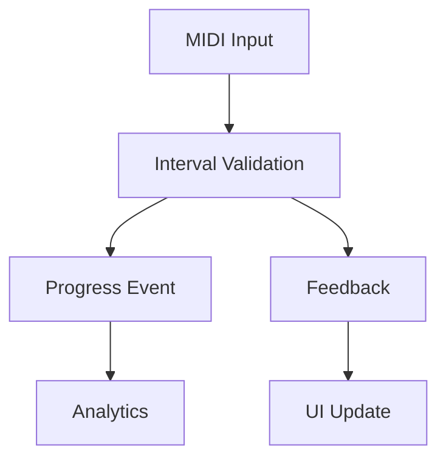

# Design Improvements Analysis

## 1. Interval Classification System

### Current Issues
- Tight coupling between detection and classification
- Limited context awareness
- Insufficient support for different musical traditions
- Lack of validation pipeline

### Improved Design
```cpp
// Core interval system
class IntervalSystem {
	// Immutable interval representation
	class IntervalValue {
		const Pitch pitch1;
		const Pitch pitch2;
		const TonalContext context;
		
		IntervalQuality computeQuality() const;
		bool isCompound() const;
	};
	
	// Classification pipeline
	class ClassificationPipeline {
		std::vector<std::unique_ptr<Classifier>> classifiers;
		ValidationContext context;
		
		ClassificationResult classify(const IntervalValue& interval);
		void validateClassification(const ClassificationResult& result);
	};
};

// Musical context
class TonalContext {
	Scale currentScale;
	Mode currentMode;
	KeySignature key;
	std::optional<HarmonicContext> harmonicContext;
	
	bool isValidInContext(const IntervalValue& interval) const;
	std::vector<IntervalType> getPossibleTypes(const IntervalValue& interval) const;
};
```

## 2. MIDI Event System

### Current Issues
- Unclear event propagation paths
- Potential race conditions
- Insufficient error handling
- Limited recovery mechanisms

### Improved Design
```cpp
// MIDI event processing
class MIDIEventSystem {
	// Lock-free event channels
	class EventChannels {
		moodycamel::ConcurrentQueue<RealTimeEvent> realTimeQueue;
		moodycamel::ConcurrentQueue<ProcessingEvent> processingQueue;
		std::atomic<SystemState> systemState;
		
		void routeEvent(const MIDIEvent& event);
		void processRealTimeEvents();
	};
	
	// Error recovery
	class ErrorHandler {
		CircularBuffer<MIDIEvent> eventHistory;
		std::unordered_map<ErrorType, RecoveryStrategy> recoveryStrategies;
		
		void handleError(const MIDIError& error);
		void restoreState(const SystemState& targetState);
	};
};

// Event propagation
class EventPropagation {
	// Event routing
	class EventRouter {
		std::vector<EventSubscriber> subscribers;
		EventPriorityQueue priorityQueue;
		
		void propagateEvent(const MIDIEvent& event);
		void handleEventTimeout(const EventId& id);
	};
};
```

## 3. Progress Tracking System

### Current Issues
- Data consistency in concurrent updates
- Inefficient event storage
- Limited analytics capabilities
- Poor scalability

### Improved Design
```cpp
// Progress tracking
class ProgressSystem {
	// Event sourcing
	class EventStore {
		std::vector<ProgressEvent> events;
		std::shared_ptr<ProgressSnapshot> currentSnapshot;
		size_t snapshotInterval;
		
		void applyEvent(const ProgressEvent& event);
		void createSnapshot();
	};
	
	// Concurrent updates
	class UpdateManager {
		std::shared_mutex stateMutex;
		std::atomic<Version> stateVersion;
		OptimisticLock updateLock;
		
		UpdateResult tryUpdate(const ProgressUpdate& update);
		void resolveConflict(const UpdateConflict& conflict);
	};
};

// Analytics engine
class AnalyticsEngine {
	// Real-time analysis
	class RealTimeAnalyzer {
		TimeSeriesDB timeSeriesData;
		MetricsAggregator aggregator;
		
		void analyzeProgress(const UserId& user);
		void detectPatterns(const ProgressData& data);
	};
	
	// Prediction engine
	class PredictionEngine {
		MachineLearningModel model;
		PerformanceHistory history;
		
		void predictProgress(const UserId& user);
		void adjustDifficulty(const ProgressMetrics& metrics);
	};
};
```

## Implementation Considerations

1. **Interval Classification**
   - Use immutable value objects for intervals
   - Implement pluggable classification strategies
   - Add comprehensive validation pipeline
   - Support multiple musical traditions

2. **MIDI Event System**
   - Use lock-free queues for real-time events
   - Implement priority-based event processing
   - Add robust error recovery mechanisms
   - Include event timeout handling

3. **Progress Tracking**
   - Implement event sourcing with snapshots
   - Use optimistic concurrency control
   - Add real-time analytics capabilities
   - Include machine learning for predictions

## Migration Strategy

1. **Phase 1: Core Improvements**
   - Implement new interval system
   - Add MIDI event channels
   - Set up basic progress tracking

2. **Phase 2: Enhanced Features**
   - Add advanced classification
   - Implement error recovery
   - Add analytics capabilities

3. **Phase 3: Integration**
   - Connect all systems
   - Implement monitoring
   - Add performance metrics

## 4. System Interaction Patterns

### 4.1 Cross-System Validation
```cpp
// Validation coordination
class ValidationCoordinator {
	// Cross-system validation
	class CrossValidator {
		IntervalSystem& intervalSystem;
		MIDIEventSystem& midiSystem;
		ProgressSystem& progressSystem;
		
		ValidationResult validateInteraction(const SystemEvent& event);
		void synchronizeState(const ValidationResult& result);
	};
	
	// State consistency
	class ConsistencyManager {
		std::atomic<SystemState> globalState;
		StateValidationRules validationRules;
		
		bool validateStateTransition(const StateTransition& transition);
		void enforceConsistency();
	};
};
```

### 4.2 Event Flow Patterns


### 4.3 Data Flow Validation
```cpp
// Data flow validation
class DataFlowValidator {
	// Flow validation
	class FlowValidator {
		std::vector<ValidationRule> flowRules;
		DataFlowGraph flowGraph;
		
		bool validateDataFlow(const DataFlow& flow);
		void detectCycles();
	};
	
	// Data consistency
	class ConsistencyChecker {
		std::unordered_map<DataType, ValidationRule> typeRules;
		
		bool checkConsistency(const DataFlow& flow);
		void enforceInvariants();
	};
};
```

## 5. Performance Considerations

### 5.1 Critical Paths
- MIDI Input → Interval Classification: < 5ms
- Interval Validation → Progress Update: < 10ms
- Progress Update → Analytics: Background processing
- Analytics → UI Update: Next frame

### 5.2 Resource Management
- Use object pools for frequent allocations
- Implement lock-free queues for event processing
- Use memory-mapped files for large datasets
- Implement smart caching strategies