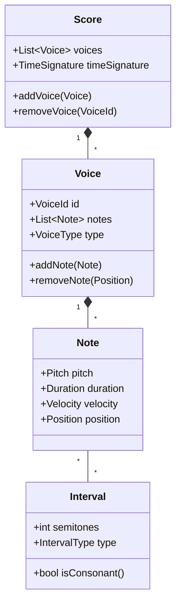
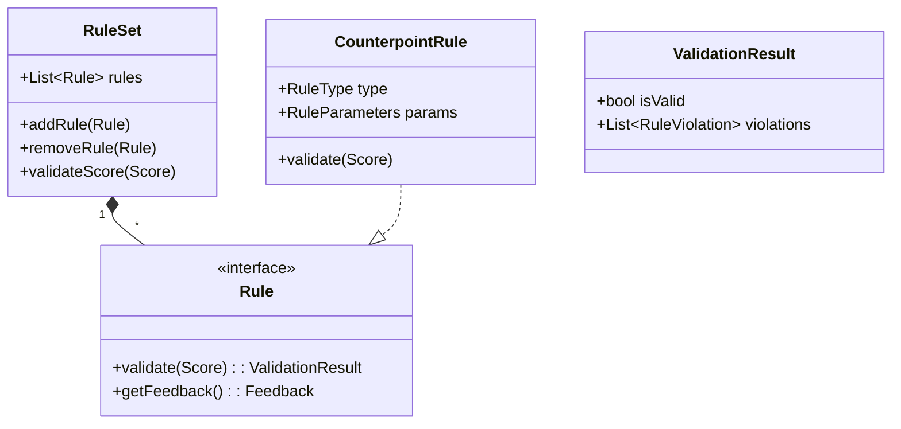
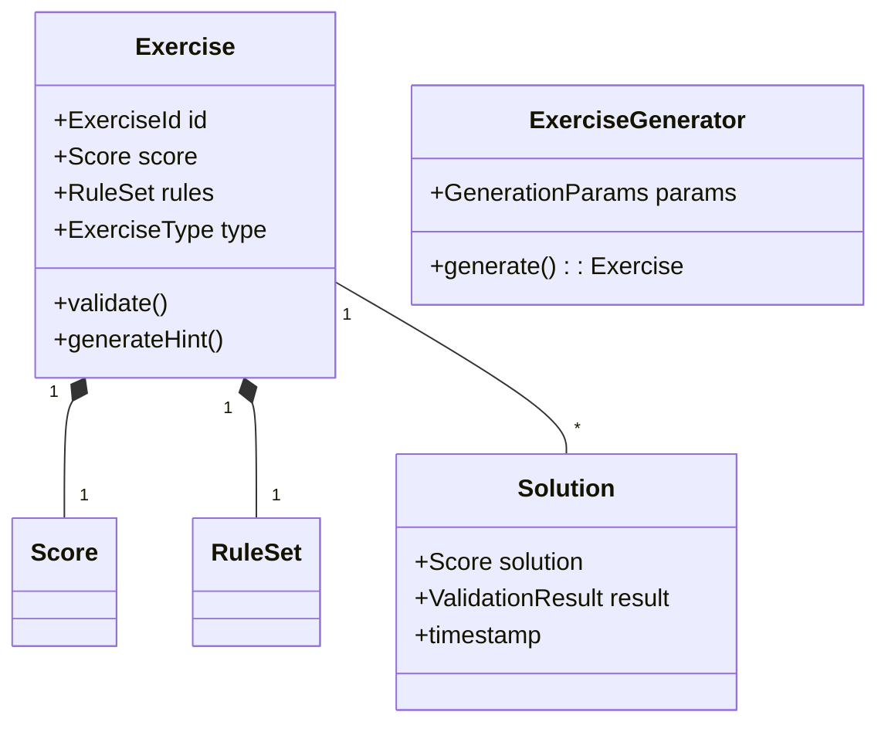

# Domain Model - MusicTrainerV3

## Overview

This document outlines the domain model for MusicTrainerV3, a music theory training application. The core domain revolves around musical concepts like notes, voices, scores, and intervals.  A rule system governs the correctness of musical compositions, and exercises are generated based on these rules. The application uses a layered architecture to separate concerns and facilitate maintainability and extensibility.  Key entities include:

* **Note:** Represents a single musical note with pitch, duration, velocity, and position.
* **Voice:** A collection of notes played simultaneously.
* **Score:** A composition consisting of multiple voices.
* **Interval:** The distance between two notes.
* **Rule:** Defines constraints for musical correctness.
* **RuleSet:** A collection of rules.
* **Exercise:** A musical task for the user to complete.
* **Solution:** A user's attempt at solving an exercise.


# Domain Model - MusicTrainerV2


## Core Domain

### Music Theory Domain


### Rule System Domain


### Exercise Domain


## Implementation Structure

```
src/
├── domain/
│   ├── music/
│   │   ├── Note.h
│   │   ├── Voice.h
│   │   ├── Score.h
│   │   └── Interval.h
│   ├── rules/
│   │   ├── Rule.h
│   │   ├── RuleSet.h
│   │   └── CounterpointRules/
│   └── exercise/
│       ├── Exercise.h
│       ├── Generator.h
│       └── Solution.h
├── application/
│   ├── services/
│   │   ├── MusicTheoryService.h
│   │   ├── RuleValidationService.h
│   │   └── ExerciseService.h
│   └── usecases/
│       ├── ScoreManagement.h
│       ├── ExerciseGeneration.h
│       └── RuleProcessing.h
├── infrastructure/
│   ├── midi/
│   │   ├── MIDIManager.h
│   │   └── MIDIEvent.h
│   ├── persistence/
│   │   ├── ScoreRepository.h
│   │   └── ExerciseRepository.h
│   └── plugins/
│       ├── PluginManager.h
│       └── PluginLoader.h
└── presentation/
	├── viewport/
	│   ├── ViewportManager.h
	│   ├── NoteGrid.h
	│   ├── GridCell.h
	│   └── CoordinateMapper.h
	├── ui/
	│   ├── PianoRoll.h
	│   ├── RuleVisualizer.h
	│   └── ExerciseView.h
	└── viewmodels/
		├── ScoreViewModel.h
		├── RuleViewModel.h
		└── ExerciseViewModel.h
```

## Implementation Structure

```
```
src/
├── domain/
│   ├── music/
│   │   ├── Note.h
│   │   ├── Voice.h
│   │   ├── Score.h
│   │   └── Interval.h
│   ├── rules/
│   │   ├── Rule.h
│   │   ├── RuleSet.h
│   │   └── CounterpointRules/
│   └── exercise/
│       ├── Exercise.h
│       ├── Generator.h
│       └── Solution.h
├── application/
│   ├── services/
│   │   ├── MusicTheoryService.h
│   │   ├── RuleValidationService.h
│   │   └── ExerciseService.h
│   └── usecases/
│       ├── ScoreManagement.h
│       ├── ExerciseGeneration.h
│       └── RuleProcessing.h
├── infrastructure/
│   ├── midi/
│   │   ├── MIDIManager.h
│   │   └── MIDIEvent.h
│   ├── persistence/
│   │   ├── ScoreRepository.h
│   │   └── ExerciseRepository.h
│   └── plugins/
│       ├── PluginManager.h
│       └── PluginLoader.h
└── presentation/
	├── viewport/
	│   ├── ViewportManager.h
	│   ├── NoteGrid.h
	│   ├── GridCell.h
	│   └── CoordinateMapper.h
	├── ui/
	│   ├── PianoRoll.h
	│   ├── RuleVisualizer.h
	│   └── ExerciseView.h
	└── viewmodels/
		├── ScoreViewModel.h
		├── RuleViewModel.h
		└── ExerciseViewModel.h
```

## Layered Architecture Rationale

The application employs a layered architecture to promote modularity, maintainability, and testability.  Each layer has distinct responsibilities:

* **Domain Layer (`src/domain`):** Contains core domain objects and business logic, independent of any specific infrastructure or presentation concerns. This layer defines the core musical concepts and rules.

* **Application Layer (`src/application`):**  Houses services and use cases that orchestrate the interaction between the domain layer and the infrastructure layer. Services encapsulate business logic related to specific tasks, while use cases represent high-level user interactions.

* **Infrastructure Layer (`src/infrastructure`):** Provides access to external resources like MIDI devices, persistent storage, and plugins. This layer abstracts away the details of these resources, allowing the application layer to remain independent of specific implementations.

* **Presentation Layer (`src/presentation`):** Responsible for user interface and interaction. This layer uses view models to present data from the application layer to the user.

This layered approach allows for independent development and testing of each layer, promoting code reusability and reducing dependencies between different parts of the application.


## Key Design Decisions

1. **Immutable Domain Objects:** All domain objects (Note, Interval, Score, etc.) are immutable.  This means that once an object is created, its state cannot be changed.  Instead of modifying an existing object, creating a new object with the desired changes is the only way to alter the state. This approach simplifies reasoning about the application's state and makes it easier to track changes. Alternatives considered included mutable objects, but the complexity of managing concurrent modifications and potential side effects led to the choice of immutability.

2. **Event-Driven Architecture:** The application uses an event-driven architecture to handle changes in the domain model.  Domain events are triggered whenever a significant change occurs (e.g., a note is added to a score, a rule is violated).  These events are then handled by event listeners, which can update the UI or perform other actions. This approach decouples different parts of the application and makes it easier to add new features or modify existing ones without affecting other parts of the system.  Alternatives included a more direct approach to updating the UI, but this would have led to tighter coupling and made the system harder to maintain.

3. **Plugin System:** A plugin system allows for dynamic loading of rule sets and exercise generators. This makes the application highly extensible, allowing for the addition of new features without modifying the core codebase.  The plugin system uses a well-defined interface to ensure compatibility between different plugins. Alternatives included hardcoding rules and generators into the application, but this would have made it much harder to add new features.

4. **MIDI Integration:** An abstract MIDI interface is used to provide device independence.  This allows the application to work with different MIDI devices without requiring significant code changes.  Event-based MIDI processing ensures that the application responds efficiently to MIDI events. Alternatives included direct interaction with specific MIDI devices, but this would have reduced portability and increased complexity.

5. **State Management:** The command pattern is used to handle user actions, providing a clear and consistent way to manage changes to the application's state.  Event sourcing is used to record all changes to the domain model, allowing for undo/redo functionality.  Alternatives considered included simpler state management techniques, but these lacked the robustness and flexibility offered by the command pattern and event sourcing.

6. **Dynamic Grid Management:** A sparse matrix representation is used for efficient memory use, especially when dealing with large scores.  Viewport-based content loading/unloading ensures that only the currently visible portion of the score is loaded into memory.  Coordinate mapping provides a consistent way to translate between screen coordinates and musical notation. Alternatives included a dense matrix representation, but this would have been significantly less memory-efficient for large scores.
