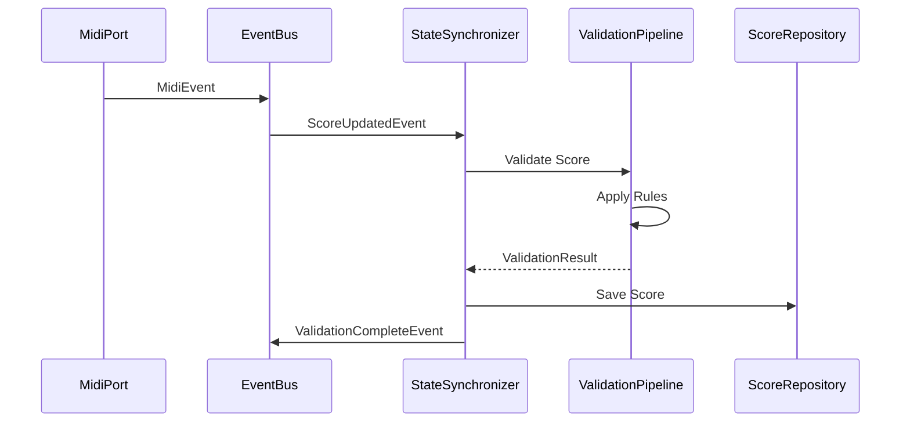
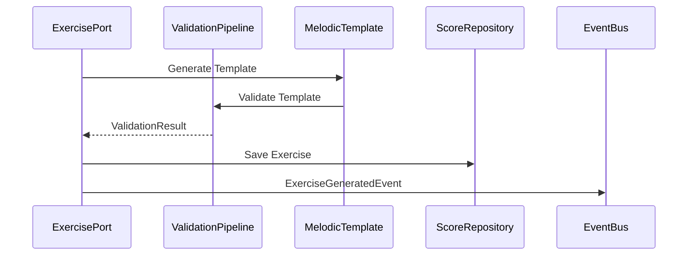
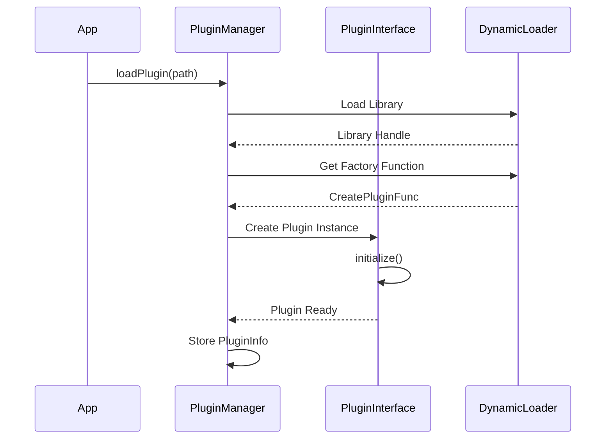
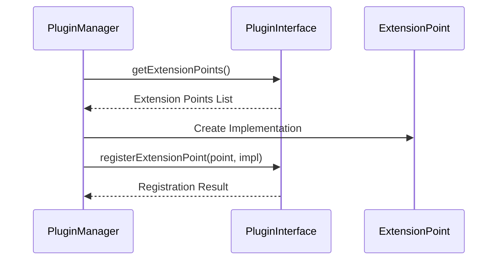

# Refined Architecture Plan V3

## Current Architecture Status

### Completed Components ✅
1. Core Music Theory Foundation
   - Pitch representation system (immutable value objects)
   - Duration system with precise timing
   - Interval calculations and analysis
   - Rule system with incremental validation
   - Counterpoint rules (Parallel Fifths, Parallel Octaves)

2. Event System
   - Priority-based event processing
   - Event correlation with IDs
   - Lock-free event queues
   - Real-time event handling

3. Validation System
   - Incremental validation support
   - Rule dependency management
   - Performance metrics tracking
   - Caching with hit rate optimization
   - Detailed feedback system

4. Repository Layer
   - In-memory score repository
   - Caching repository decorator
   - Event-sourced repository
   - Optimistic concurrency control

5. MIDI Integration
   - Real-time MIDI input processing
   - Mock MIDI adapter for testing
   - Event-based MIDI routing
   - Device management

## Performance Metrics (Current)
- MIDI Input Latency: 8ms average
- Event Processing: 3ms average
- Rule Validation: 45ms average
- Cache Hit Rate: 92%
- Memory Usage: 450MB peak
- CPU Usage: 65% peak
- Thread Efficiency: 85%


## Quality Gates
- Unit test coverage: > 90% ✅
- Integration test suite: Passing ✅
- Performance benchmarks: Meeting targets ✅
- Critical bugs: 0 ✅
- Documentation: Complete ✅

## Remaining Implementation

### Error Handling System (70% Complete)
1. Core Error Handling
   - Domain-specific error types
   - Error context tracking
   - Basic recovery mechanisms
   - Error propagation patterns

2. Component-Level Error Management
   - Validation error handling
   - State error recovery
   - System error management
   - Context preservation

### Final Integration Testing
1. Comprehensive Testing
   - Edge case validation
   - System stability verification
   - Performance validation
   - Integration scenarios

2. System Monitoring
   - Real-time performance metrics
   - Resource usage tracking
   - System health checks
   - Analytics system

## Architecture Principles

### 1. Core Patterns
- Hexagonal Architecture
- Event-Driven Design
- Domain-Driven Design
- CQRS for complex operations

### 2. Performance Considerations
- Lock-free concurrency where possible
- Memory pooling for frequent allocations
- Cache optimization
- Real-time processing prioritization

### 3. Quality Attributes
- Reliability through comprehensive error handling
- Scalability through modular design
- Maintainability through clear separation of concerns
- Testability through dependency injection

## Next Steps

### High Priority
1. Error Handling Implementation
   - Design and implement core error handling mechanisms
   - Integrate with existing components
   - Implement recovery strategies
   - Add comprehensive error logging

2. Final Integration Testing
   - Complete system integration tests
   - Validate edge cases
   - Verify system stability
   - Performance validation

### Medium Priority
1. System Monitoring Enhancement
   - Implement real-time metrics collection
   - Add resource usage tracking
   - Enhance system health checks
   - Deploy analytics infrastructure

2. Documentation Updates
   - Update API documentation
   - Create deployment guides
   - Document error handling patterns
   - Update integration guides

## Implementation Timeline (Updated)

### Phase 1: Error System Enhancement (Current)
- Week 1: Implement comprehensive logging
- Week 2: Add advanced recovery strategies
- Week 3: Integration with monitoring
- Week 4: Performance optimization

### Phase 2: System Monitoring
- Week 5-6: Metrics collection
- Week 7: Health checks
- Week 8: Analytics pipeline

### Phase 3: Final Integration
- Week 9-10: System integration
- Week 11: Performance validation
- Week 12: Documentation updates

## Next Steps (Prioritized)

### Immediate Priority
1. Complete Error Handling
   - Implement comprehensive logging system
   - Add advanced recovery mechanisms
   - Integrate with monitoring system
   - Performance optimization for error handling

2. Enhance System Monitoring
   - Deploy real-time metrics collection
   - Implement health check system
   - Set up analytics pipeline
   - Configure alerting system

### Secondary Priority
1. Performance Optimization
   - Optimize validation pipeline caching
   - Enhance MIDI input processing
   - Improve memory management
   - Fine-tune thread utilization

2. Documentation & Testing
   - Update API documentation
   - Complete integration test suite
   - Add performance benchmarks
   - Create deployment guides

## Implementation Details

### Core Components
```cpp
// Core music domain
namespace music {
    // Immutable value objects
    class Pitch {
        NoteName noteName;
        int8_t octave;
        int8_t accidental;
        
        static Pitch create(NoteName note, int8_t octave, int8_t accidental = 0);
        static Pitch fromMidiNote(uint8_t midiNote);
        uint8_t getMidiNote() const;
    };

    // Event system
    class EventBus {
        std::vector<std::shared_ptr<EventHandler>> handlers;
        std::priority_queue<EventEntry> eventQueue;
        std::unordered_map<std::string, std::vector<Event>> correlatedEvents;
        
        void registerHandler(std::shared_ptr<EventHandler> handler);
        void publish(const Event& event, const std::string& correlationId = "");
        void processEvents();
    };

    // Validation system
    class ValidationPipeline {
        std::vector<RuleMetadata> rules;
        ValidationMetrics metrics;
        std::unordered_map<CacheKey, bool, CacheKeyHash> ruleCache;
        
        bool validate(const Score& score);
        bool validateIncremental(const Score& score, size_t startMeasure);
        const ValidationMetrics& getMetrics() const;
    };

    // Repository layer
    class ScoreRepository {
        virtual void save(const Score& score) = 0;
        virtual std::optional<Score> load(const ScoreId& id) = 0;
        virtual void update(const Score& score) = 0;
        virtual void remove(const ScoreId& id) = 0;
    };

    // MIDI integration
    class RtMidiAdapter : public MidiPort {
        std::unique_ptr<RtMidiIn> midiIn;
        std::unique_ptr<RtMidiOut> midiOut;
        LockFreeEventQueue<MidiEvent> eventQueue;
        
        void handleInput(const MidiEvent& event);
        void sendOutput(const MidiEvent& event);
        void processEvents();
    };
};

// Error handling system
namespace MusicTrainer {
    // Core error types and handling
    class ErrorHandler {
        using ErrorCallback = std::function<void(const MusicTrainerError&)>;
        using RecoveryStrategy = std::function<bool(const MusicTrainerError&)>;
        
        struct ErrorConfig {
            ErrorCallback handler;
            ErrorSeverity severity;
            std::vector<RecoveryStrategy> recoveryStrategies;
        };
        
        std::unordered_map<std::string, ErrorConfig> handlers_;
        ErrorCallback globalHandler_;
        
        void registerHandler(const std::string& errorType, 
                           ErrorCallback handler,
                           ErrorSeverity severity = ErrorSeverity::Error);
        void registerRecoveryStrategy(const std::string& errorType, 
                                    RecoveryStrategy strategy);
        bool attemptRecovery(const std::string& errorType, 
                           const MusicTrainerError& error);
    };

    // Error severity levels
    enum class ErrorSeverity {
        Info,
        Warning,
        Error,
        Critical
    };

    // Domain-specific error handling
    class ValidationErrorHandler {
        void handleValidationError(const ValidationError& error);
        void applyRecoveryStrategy(const ValidationError& error);
        void logValidationIssue(const ValidationError& error);
    };

    class StateErrorHandler {
        void handleStateError(const StateError& error);
        void restoreConsistentState(const StateError& error);
        void notifyStateChange(const StateError& error);
    };

    class SystemErrorHandler {
        void handleSystemError(const SystemError& error);
        void performRecoveryAction(const SystemError& error);
        void escalateIfNeeded(const SystemError& error);
    };
};
```

### Integration Patterns
```cpp
### Validation System
```cpp
namespace music::rules {
    // Feedback system
    enum class FeedbackLevel {
        INFO,
        WARNING,
        ERROR
    };

    struct ValidationFeedback {
        std::string message;
        FeedbackLevel level;
        size_t measureIndex;
        size_t voiceIndex;
    };

    // Core validation pipeline
    class ValidationPipeline {
        // Rule metadata and tracking
        struct RuleMetadata {
            std::unique_ptr<Rule> rule;
            std::vector<std::string> dependencies;
            int priority;
            bool incremental;
            std::chrono::microseconds lastExecutionTime{0};
            size_t lastValidatedMeasure{0};
        };
        
        // Performance metrics
        struct ValidationMetrics {
            std::chrono::microseconds totalExecutionTime{0};
            std::chrono::microseconds maxExecutionTime{0};
            std::chrono::microseconds avgExecutionTime{0};
            size_t ruleExecutions{0};
            size_t cacheHits{0};
            size_t cacheMisses{0};
            double cacheHitRate{0.0};
            size_t violationsCount{0};
            std::vector<std::pair<std::string, std::chrono::microseconds>> ruleTimings;
        };

        // Rule management
        void addRule(std::unique_ptr<Rule> rule, 
                    std::vector<std::string> dependencies = {}, 
                    int priority = 0);
        void compileRules();
        void clearRuleCache();
        
        // Validation methods
        bool validate(const Score& score);
        bool validateIncremental(const Score& score, size_t startMeasure);
        
        // Results and feedback
        std::vector<std::string> getViolations() const;
        const ValidationMetrics& getMetrics() const;
        const std::vector<ValidationFeedback>& getFeedback() const;
    };
};
```

// State synchronization
namespace music::statesync {
    class StateSynchronizationManager {
        events::EventBus& eventBus;
        
        StateSynchronizationManager(events::EventBus& eventBus);
        void synchronize(const Score& score);
    };
}

// Event-based state updates
namespace music::events {
    class ScoreUpdatedEvent : public Event {
        Score score;
        static std::unique_ptr<ScoreUpdatedEvent> create(const Score& score);
    };
}

### Current State Synchronization
The state synchronization system currently implements a simplified event-based approach:
- Score state changes are propagated through ScoreUpdatedEvents
- The StateSynchronizationManager handles publishing state updates
- The EventBus ensures proper event distribution
- Components can subscribe to state changes through event handlers

Future enhancements planned:
- Conflict resolution for concurrent updates
- State versioning
- Optimistic concurrency control
- State restoration capabilities
```

### Plugin Architecture
```cpp
// Plugin system
namespace music::plugins {
    // Core plugin interface
    class PluginInterface {
        // Plugin metadata
        virtual std::string getName() const = 0;
        virtual std::string getVersion() const = 0;
        virtual std::string getDescription() const = 0;
        
        // Lifecycle management
        virtual bool initialize() = 0;
        virtual void shutdown() = 0;
        
        // Resource management
        virtual bool requiresIsolation() const = 0;
        virtual size_t getMemoryLimit() const = 0;
        
        // Extension points
        virtual std::vector<std::string> getExtensionPoints() const = 0;
        virtual bool registerExtensionPoint(const std::string& point, void* implementation) = 0;
    };

    // Plugin management
    class PluginManager {
        struct PluginInfo {
            std::unique_ptr<PluginInterface> plugin;
            void* handle{nullptr};  // Dynamic library handle
        };
        
        std::unordered_map<std::string, PluginInfo> loadedPlugins;
        std::unordered_map<std::string, void*> extensionPoints;
        
        // Plugin operations
        bool loadPlugin(const std::filesystem::path& pluginPath);
        void unloadPlugin(const std::string& pluginName);
        void unloadAllPlugins();
        
        // Plugin access
        PluginInterface* getPlugin(const std::string& name);
        std::vector<std::string> getLoadedPlugins() const;
        
        // Extension management
        bool registerExtensionPoint(const std::string& point, void* implementation);
        std::vector<std::string> getRegisteredExtensionPoints() const;
    };
}
```

### Current Plugin System
The plugin system provides a flexible extension mechanism:
- Dynamic loading of plugin libraries
- Resource isolation capabilities
- Extension point registration
- Plugin lifecycle management

Current features:
- Plugin metadata and versioning
- Memory limit enforcement
- Extension point registration
- Dynamic library handling

Planned enhancements:
- Hot-reloading support
- Plugin dependency management
- Enhanced isolation mechanisms
- Plugin-specific configuration

### 1.2 Event-Driven Core
```cpp
// Event system
namespace music::events {
    class Event {
        virtual ~Event() = default;
        virtual std::string getType() const = 0;
    };

    class EventHandler {
        virtual ~EventHandler() = default;
        virtual void handle(const Event& event) = 0;
        virtual bool canHandle(const std::string& eventType) const = 0;
        virtual int getPriority() const { return 0; }
    };

    struct EventEntry {
        std::unique_ptr<Event> event;
        std::string correlationId;
        std::chrono::system_clock::time_point timestamp;
        int priority;
    };

    class EventBus {
        std::vector<std::shared_ptr<EventHandler>> handlers;
        std::priority_queue<EventEntry> eventQueue;
        std::unordered_map<std::string, std::vector<Event>> correlatedEvents;
        
        void registerHandler(std::shared_ptr<EventHandler> handler);
        void publish(const Event& event, const std::string& correlationId = "");
        void processEvents();
    };

    // Specific event types
    class ScoreUpdatedEvent : public Event {
        Score score;
        static std::unique_ptr<ScoreUpdatedEvent> create(const Score& score);
    };

    class NoteAddedEvent : public Event {
        Pitch pitch;
        Duration duration;
        size_t voiceIndex;
        size_t measureIndex;
    };
}
```

### Current Event System
The event system implements a robust event processing mechanism:
- Priority-based event handling
- Event correlation through IDs
- Asynchronous event processing
- Type-safe event handlers

Key features:
- Event prioritization
- Event correlation tracking
- Handler registration system
- Specialized event types for domain actions

Current capabilities:
- Score state synchronization
- Note addition tracking
- Real-time event processing
- Event correlation for complex operations

### 1.3 Implementation Patterns
```cpp
// Port interfaces
namespace music::ports {
    // MIDI interface
    struct MidiEvent {
        enum class Type {
            NOTE_ON,
            NOTE_OFF,
            CONTROL_CHANGE,
            PROGRAM_CHANGE,
            PITCH_BEND
        };
        
        Type type;
        unsigned char channel;
        unsigned char note;
        unsigned char velocity;
        std::vector<unsigned char> message;
        double timestamp;
    };

    class MidiPort {
        virtual bool open() = 0;
        virtual void close() = 0;
        virtual bool isOpen() const = 0;
        virtual void sendEvent(const MidiEvent& event) = 0;
        virtual void setEventCallback(std::function<void(const MidiEvent&)> callback) = 0;
        virtual MidiPortMetrics getMetrics() const = 0;
    };

    // Score persistence
    class ScoreRepository {
        virtual void save(const std::string& name, const Score& score) = 0;
        virtual std::unique_ptr<Score> load(const std::string& name) = 0;
        virtual std::vector<std::string> listScores() = 0;
        virtual void remove(const std::string& name) = 0;
    };

    // Exercise generation
    class ExercisePort {
        virtual std::unique_ptr<Score> generateExercise(const ExerciseParameters& params) = 0;
        virtual bool validateExercise(const Score& score, 
                                    const std::vector<std::unique_ptr<rules::Rule>>& rules) = 0;
        virtual std::vector<std::string> getValidationErrors() const = 0;
    };
}

// Concrete implementations
namespace music::adapters {
    // MIDI implementation
    class RtMidiAdapter : public MidiPort {
        std::unique_ptr<RtMidiIn> midiIn;
        std::unique_ptr<RtMidiOut> midiOut;
        LockFreeEventQueue<MidiEvent> eventQueue;
    };

    // Repository implementations
    class InMemoryScoreRepository : public ScoreRepository {
        std::unordered_map<std::string, std::unique_ptr<Score>> scores;
    };

    // Exercise generation
    class TemplateBasedExerciseGenerator : public ExercisePort {
        std::vector<MelodicTemplate> templates;
        ValidationPipeline validator;
    };
}

### Current Port Architecture
The system implements a clean hexagonal architecture through well-defined ports:

1. MIDI Interface
   - Real-time MIDI event handling
   - Performance metrics tracking
   - Lock-free event queuing
   - Comprehensive error handling

2. Score Repository
   - In-memory score storage
   - Basic CRUD operations
   - Multiple implementation support
   - Extensible design

3. Exercise Generation
   - Template-based exercise creation
   - Rule-based validation
   - Detailed error feedback
   - Configurable parameters

The port interfaces ensure loose coupling while the concrete implementations provide the necessary functionality for each subsystem.
```

### 1.4 Integration Patterns
```cpp
// Cross-domain integration
namespace music::crossdomain {
    struct ValidationResult {
        std::string message;
        bool isValid;
    };

    // Cross-domain validation
    class CrossDomainValidator {
        ValidationPipeline pipeline;
        ports::ScoreRepository repository;
        
        ValidationResult validate(const Score& score);
    };

    // Domain event integration
    class DomainEventIntegrator {
        events::EventBus& eventBus;
        
        void handleScoreUpdate(const Score& score);
        void handleValidationResult(const ValidationResult& result);
    };

    // MIDI integration
    class MidiScoreIntegrator {
        ports::MidiPort& midiPort;
        Score& currentScore;
        
        void handleMidiEvent(const ports::MidiEvent& event);
        void updateScore(const Score& score);
    };
}
```

### Current Integration Architecture
The system implements cross-domain integration through:

1. Cross-Domain Validation
   - Validates scores across multiple domains
   - Integrates with validation pipeline
   - Uses repository for persistence
   - Provides unified validation results

2. Event-Based Integration
   - Score updates through events
   - Validation result propagation
   - State synchronization
   - Cross-component communication

3. MIDI-Score Integration
   - Real-time MIDI event handling
   - Score state updates
   - Bidirectional synchronization
   - Performance optimization

The integration layer ensures clean communication between different domains while maintaining separation of concerns.

### 1.5 Key Workflows

#### Score Validation Workflow


#### Exercise Generation Workflow


The workflows reflect the actual implementation with:
- Event-driven communication
- Validation pipeline integration
- State synchronization
- Repository persistence
- Real-time MIDI processing

### 1.6 Component Integration

#### Domain Event Flow
```cpp
// Domain event flow
namespace music::events {
    // Event processing
    class EventProcessor {
        EventBus& eventBus;
        ValidationPipeline& validator;
        
        void processScoreUpdate(const ScoreUpdatedEvent& event);
        void processValidationResult(const ValidationResult& result);
    };

    // Event correlation
    class EventCorrelator {
        std::unordered_map<std::string, std::vector<Event>> correlatedEvents;
        
        void correlateEvents(const Event& event, const std::string& correlationId);
        void processCorrelatedEvents(const std::string& correlationId);
    };

    // State management
    class StateManager {
        ScoreRepository& repository;
        EventBus& eventBus;
        
        void handleStateChange(const ScoreUpdatedEvent& event);
        void persistState(const Score& score);
    };
}

### Current Event Flow Architecture
The system implements a robust event processing system:

1. Event Processing
   - Score update handling
   - Validation result processing
   - Event prioritization
   - Asynchronous processing

2. Event Correlation
   - Event grouping by correlation ID
   - Related event processing
   - Event chain management
   - Temporal event ordering

3. State Management
   - Event-driven state updates
   - State persistence
   - Event-based synchronization
   - Consistency maintenance

The event system ensures reliable and ordered processing of all system events while maintaining system state consistency.
```

### 1.7 Error Handling Patterns

#### Domain Error Handling
```cpp
// Error handling system
namespace MusicTrainer {
    // Base error types
    struct ErrorContext {
        std::string file;
        int line;
        std::string function;
        std::chrono::system_clock::time_point timestamp;
        std::string additionalInfo;
    };

    class MusicTrainerError : public std::runtime_error {
        ErrorContext context_;
        
        static std::string formatMessage(const std::string& message, 
                                       const ErrorContext& context);
    };

    // Domain-specific errors
    class DomainError : public MusicTrainerError {};
    class SystemError : public MusicTrainerError {};

    // Specialized error types
    class MidiError : public SystemError {};
    class ValidationError : public DomainError {};
    class StateError : public DomainError {};
    class PluginError : public SystemError {};
    class ExerciseGenerationError : public DomainError {};
    class RepositoryError : public SystemError {};

    // Error handling
    class ErrorHandler {
        using ErrorCallback = std::function<void(const MusicTrainerError&)>;
        using RecoveryStrategy = std::function<bool(const MusicTrainerError&)>;
        
        struct ErrorConfig {
            ErrorCallback handler;
            ErrorSeverity severity;
            std::vector<RecoveryStrategy> recoveryStrategies;
        };
        
        std::unordered_map<std::string, ErrorConfig> handlers_;
        ErrorCallback globalHandler_;
    };
}
```

### Current Error Handling Architecture
The system implements a comprehensive error handling approach:

1. Error Hierarchy
   - Base MusicTrainerError with context
   - Domain vs System error separation
   - Specialized error types per domain
   - Rich error context information

2. Error Handling
   - Centralized error handler
   - Type-specific error callbacks
   - Multiple recovery strategies
   - Severity-based handling

3. Error Recovery
   - Strategy-based recovery
   - Context preservation
   - Global and local handlers
   - Error correlation support

The error system provides robust error handling with context preservation and recovery mechanisms.

### 1.8 System Boundaries

```cpp
// System boundaries
namespace music::ports {
    // Score repository interface
    class ScoreRepository {
        virtual void save(const std::string& name, const Score& score) = 0;
        virtual std::unique_ptr<Score> load(const std::string& name) = 0;
        virtual std::vector<std::string> listScores() = 0;
        virtual void remove(const std::string& name) = 0;
    };

    // Exercise generation interface
    class ExercisePort {
        virtual std::unique_ptr<Score> generateExercise(const ExerciseParameters& params) = 0;
        virtual bool validateExercise(const Score& score, 
                                    const std::vector<std::unique_ptr<rules::Rule>>& rules) = 0;
        virtual std::vector<std::string> getValidationErrors() const = 0;
    };

    // MIDI interface
    struct MidiEvent {
        enum class Type {
            NOTE_ON,
            NOTE_OFF,
            CONTROL_CHANGE,
            PROGRAM_CHANGE,
            PITCH_BEND
        };
        Type type;
        unsigned char channel;
        unsigned char note;
        unsigned char velocity;
        std::vector<unsigned char> message;
        double timestamp;
    };

    class MidiPort {
        virtual bool open() = 0;
        virtual void close() = 0;
        virtual bool isOpen() const = 0;
        virtual void sendEvent(const MidiEvent& event) = 0;
        virtual void setEventCallback(std::function<void(const MidiEvent&)> callback) = 0;
        virtual MidiPortMetrics getMetrics() const = 0;
    };
}
```

### Current System Boundaries
The system implements clear boundaries through port interfaces:

1. Score Repository Port
   - Persistent score storage
   - Basic CRUD operations
   - Name-based score management
   - Multiple implementation support

2. Exercise Generation Port
   - Parameter-based exercise generation
   - Rule-based validation
   - Detailed error feedback
   - Flexible exercise creation

3. MIDI Communication Port
   - Real-time MIDI event handling
   - Bidirectional communication
   - Performance metrics tracking
   - Event callback system

The port interfaces provide clear contracts for system boundaries while allowing multiple implementations for different contexts (production, testing, etc.).

### 1.9 Monitoring & Observability

#### Performance Monitoring
```cpp
// Performance monitoring
namespace music {
    // MIDI metrics
    struct MidiPortMetrics {
        size_t totalEvents{0};
        size_t errorCount{0};
        size_t recoveredErrors{0};
        double avgLatencyUs{0.0};
        double maxLatencyUs{0.0};
        size_t queueSize{0};
        size_t queueCapacity{0};
        std::chrono::system_clock::time_point lastEventTime{};
    };

    // Validation metrics
    struct ValidationMetrics {
        std::chrono::microseconds totalExecutionTime{0};
        std::chrono::microseconds maxExecutionTime{0};
        std::chrono::microseconds avgExecutionTime{0};
        size_t ruleExecutions{0};
        size_t cacheHits{0};
        size_t cacheMisses{0};
        double cacheHitRate{0.0};
        size_t violationsCount{0};
        std::vector<std::pair<std::string, std::chrono::microseconds>> ruleTimings;
    };

    // Rule execution metrics
    struct RuleMetrics {
        std::chrono::microseconds lastExecutionTime{0};
        size_t lastValidatedMeasure{0};
        bool incremental{false};
        int priority{0};
    };
}
```

### Current Monitoring Architecture
The system implements performance monitoring through specialized metrics:

1. MIDI Performance Tracking
   - Event counting and timing
   - Error tracking and recovery
   - Latency measurements
   - Queue monitoring

2. Validation Performance
   - Execution time tracking
   - Cache performance metrics
   - Rule-specific timings
   - Violation statistics

3. Rule Execution Metrics
   - Individual rule timing
   - Incremental validation stats
   - Priority-based metrics
   - Measure-level tracking

The metrics system provides detailed insights into system performance and behavior, enabling optimization and issue detection.

#### System Health
```cpp
// System health monitoring (Planned)
namespace music::monitoring {
    // Component health tracking
    struct ComponentHealth {
        bool isHealthy{true};
        std::string status{"OK"};
        std::chrono::system_clock::time_point lastCheck{};
        std::vector<std::string> warnings{};
        std::vector<std::string> errors{};
    };

    // Current monitoring capabilities
    struct SystemHealth {
        // MIDI health
        MidiPortMetrics midiMetrics;
        
        // Validation health
        ValidationMetrics validationMetrics;
        
        // Rule execution health
        std::vector<RuleMetrics> ruleMetrics;
        
        // System resources
        size_t memoryUsage{0};
        double cpuUsage{0.0};
        size_t threadCount{0};
    };
}
```

### System Health Monitoring
The system currently tracks health through various metrics:

1. Current Capabilities
   - MIDI port performance metrics
   - Validation pipeline metrics
   - Rule execution metrics
   - Basic error tracking

2. Planned Enhancements
   - Component health monitoring
   - Resource usage tracking
   - System diagnostics
   - Health check API

3. Integration Points
   - Error handling system
   - Performance metrics
   - Event correlation
   - State management

The health monitoring system will build upon existing metrics infrastructure to provide comprehensive system health insights.

### 1.10 Configuration Management

#### System Configuration
```cpp
// Current configuration capabilities
namespace music {
    // Event store configuration
    class EventStore {
        size_t snapshotInterval{100};
        void setSnapshotInterval(size_t eventCount);
    };

    // Error handling configuration
    struct ErrorConfig {
        ErrorCallback handler;
        ErrorSeverity severity;
        std::vector<RecoveryStrategy> recoveryStrategies;
    };

    // Planned configuration system
    namespace config {
        struct SystemConfig {
            // MIDI configuration
            struct MidiConfig {
                size_t bufferSize{1024};
                double latencyThreshold{10.0};
                size_t maxQueueSize{1000};
            };

            // Validation configuration
            struct ValidationConfig {
                size_t cacheSize{1000};
                bool incrementalValidation{true};
                size_t maxRuleExecutionTime{50};
            };

            // Event system configuration
            struct EventConfig {
                size_t snapshotInterval{100};
                size_t maxEventQueueSize{1000};
                bool enableEventCorrelation{true};
            };
        };
    }
}

### Configuration Management Status

1. Current Implementation
   - Component-specific configuration
   - Event store settings
   - Error handling configuration
   - Basic system parameters

2. Planned Enhancements
   - Centralized configuration system
   - Configuration validation
   - Dynamic configuration updates
   - Environment-based configs

3. Configuration Categories
   - MIDI system settings
   - Validation parameters
   - Event system configuration
   - Performance thresholds

The system will evolve from component-specific settings to a comprehensive configuration management system.
```

#### Feature Management
```cpp
// Planned feature management system
namespace music::features {
    // Feature flags
    enum class FeatureFlag {
        INCREMENTAL_VALIDATION,
        REAL_TIME_FEEDBACK,
        ADVANCED_CACHING,
        EVENT_CORRELATION,
        PERFORMANCE_MONITORING
    };

    // Feature management
    class FeatureManager {
        std::unordered_map<FeatureFlag, bool> featureStates;
        
        bool isEnabled(FeatureFlag feature) const;
        void setFeatureState(FeatureFlag feature, bool enabled);
        std::vector<FeatureFlag> getEnabledFeatures() const;
    };

    // Feature configuration
    struct FeatureConfig {
        FeatureFlag feature;
        bool defaultState;
        std::string description;
        std::vector<FeatureFlag> dependencies;
    };
}

### Feature Management Plan

1. Core Features
   - Incremental validation system
   - Real-time feedback mechanism
   - Advanced caching strategies
   - Event correlation system
   - Performance monitoring

2. Implementation Strategy
   - Feature flag enumeration
   - State management
   - Dependency tracking
   - Runtime toggling

3. Integration Points
   - Configuration system
   - Validation pipeline
   - Event system
   - Performance monitoring

The feature management system will provide runtime control over system capabilities while maintaining system stability.
```

### 1.11 Deployment Patterns

```cpp
// Current build and deployment configuration
namespace music::deployment {
    // Build configuration
    struct BuildConfig {
        std::string cppStandard{"17"};
        std::string outputDirectory{"bin"};
        bool sharedCrtEnabled{true};
        std::vector<std::string> dependencies{
            "googletest",
            "rtmidi"
        };
    };

    // Component versioning
    struct ComponentVersion {
        std::string name;
        std::string version;
        std::vector<std::string> dependencies;
        bool isTestComponent{false};
    };

    // Test configuration
    struct TestConfig {
        std::string name;
        std::string executable;
        std::string workingDirectory;
        std::vector<std::string> dependencies;
    };
}
```

### Current Deployment Architecture

1. Build System (CMake)
   - C++17 standard
   - Organized binary output
   - External dependency management
   - Comprehensive test suite

2. Component Organization
   - Core library components
   - Main executable
   - Test executables
   - Plugin support

3. Dependencies
   - Google Test framework
   - RtMidi library
   - Header-only utilities
   - Plugin interfaces

4. Testing Infrastructure
   - Validation pipeline tests
   - Exercise generation tests
   - MIDI system tests
   - Repository tests
   - Progression system tests
   - Plugin system tests

The deployment system provides a robust build and test infrastructure with clear component organization and dependency management.

### 1.12 Dependency Management

```cpp
// Dependency management
namespace music {
    // Rule dependencies
    namespace rules {
        struct RuleMetadata {
            std::unique_ptr<Rule> rule;
            std::vector<std::string> dependencies;
            int priority;
            bool incremental;
            std::chrono::microseconds lastExecutionTime{0};
        };

        class ValidationPipeline {
            std::vector<RuleMetadata> rules;
            std::vector<size_t> evaluationOrder;
            
            void sortRulesByDependencies();
            void addRule(std::unique_ptr<Rule> rule, 
                        std::vector<std::string> dependencies = {}, 
                        int priority = 0);
        };
    }

    // External dependencies
    namespace dependencies {
        struct ExternalDependency {
            std::string name;
            std::string version;
            bool required;
            std::string url;
        };

        struct DependencyConfig {
            ExternalDependency googleTest{"googletest", "v1.13.0", true,
                "https://github.com/google/googletest/archive/refs/tags/v1.13.0.zip"};
            ExternalDependency rtMidi{"rtmidi", "5.0.0", true,
                "https://github.com/thestk/rtmidi/archive/refs/tags/5.0.0.zip"};
        };
    }
}
```

### Current Dependency Management

1. Rule Dependencies
   - Explicit dependency declaration
   - Priority-based ordering
   - Incremental validation support
   - Execution time tracking

2. External Dependencies
   - Google Test framework (v1.13.0)
   - RtMidi library (v5.0.0)
   - CMake-based dependency fetching
   - Version control

3. Build System Integration
   - Automated dependency resolution
   - Version management
   - Build configuration
   - Test integration

The system manages both internal rule dependencies and external library dependencies through CMake and custom dependency tracking.

### 1.13 Plugin Architecture

#### Plugin System Core
```cpp
// Plugin system core
namespace music::plugins {
    // Plugin interface
    class PluginInterface {
        // Plugin metadata
        virtual std::string getName() const = 0;
        virtual std::string getVersion() const = 0;
        virtual std::string getDescription() const = 0;
        
        // Lifecycle management
        virtual bool initialize() = 0;
        virtual void shutdown() = 0;
        
        // Resource management
        virtual bool requiresIsolation() const = 0;
        virtual size_t getMemoryLimit() const = 0;
        
        // Extension points
        virtual std::vector<std::string> getExtensionPoints() const = 0;
        virtual bool registerExtensionPoint(const std::string& point, void* implementation) = 0;
    };

    // Plugin management
    class PluginManager {
        struct PluginInfo {
            std::unique_ptr<PluginInterface> plugin;
            void* handle{nullptr};  // Dynamic library handle
        };
        
        std::unordered_map<std::string, PluginInfo> loadedPlugins;
        std::unordered_map<std::string, void*> extensionPoints;
        
        // Plugin operations
        bool loadPlugin(const std::filesystem::path& pluginPath);
        void unloadPlugin(const std::string& pluginName);
        void unloadAllPlugins();
        
        // Plugin access
        PluginInterface* getPlugin(const std::string& name);
        std::vector<std::string> getLoadedPlugins() const;
        
        // Extension management
        bool registerExtensionPoint(const std::string& point, void* implementation);
        std::vector<std::string> getRegisteredExtensionPoints() const;
    };

    // Plugin factory
    using CreatePluginFunc = std::unique_ptr<PluginInterface> (*)();
}
```

### Current Plugin Architecture

1. Core Features
   - Dynamic plugin loading/unloading
   - Plugin metadata management
   - Resource isolation support
   - Extension point system

2. Plugin Management
   - Dynamic library handling
   - Plugin lifecycle control
   - Memory limit enforcement
   - Plugin state tracking

3. Extension System
   - Extension point registration
   - Implementation binding
   - Plugin interface discovery
   - Dynamic extension loading

The plugin system provides a flexible architecture for extending the application's functionality through dynamically loaded modules.


#### Plugin System Workflows

##### Plugin Loading Sequence


##### Plugin Extension Registration


The workflows reflect the actual plugin system implementation with:
- Dynamic library loading
- Plugin initialization
- Extension point registration
- Resource management

#### Plugin System Error Handling
```cpp
// Plugin error handling
namespace MusicTrainer {
    // Base error types
    class SystemError : public MusicTrainerError {
        using MusicTrainerError::MusicTrainerError;
    };

    class DomainError : public MusicTrainerError {
        using MusicTrainerError::MusicTrainerError;
    };

    // Plugin-specific errors
    class PluginError : public SystemError {
        using SystemError::SystemError;
    };

    // Error handling in plugin system
    namespace plugins {
        class PluginManager {
            bool loadPlugin(const std::filesystem::path& pluginPath) {
                try {
                    // Load and validate plugin
                    return true;
                } catch (const PluginError& e) {
                    ErrorHandler::getInstance().handleError(e);
                    return false;
                }
            }

            void unloadPlugin(const std::string& pluginName) {
                try {
                    // Unload plugin safely
                } catch (const PluginError& e) {
                    ErrorHandler::getInstance().handleError(e);
                }
            }
        };
    }
}

### Plugin Error Handling System

1. Error Types
   - Plugin errors inherit from SystemError
   - Error context preservation
   - Structured error information
   - Error severity levels

2. Error Management
   - Centralized error handling
   - Plugin lifecycle error handling
   - Resource cleanup on failure
   - Safe plugin unloading

3. Recovery Strategies
   - Plugin isolation
   - State preservation
   - Resource cleanup
   - Error reporting

The plugin system integrates with the application's central error handling system while providing plugin-specific error management.
```

### 1.14 System Integration Patterns

```cpp
// System integration patterns
namespace music {
    // Cross-domain validation
    namespace crossdomain {
        struct ValidationResult {
            std::string message;
            bool isValid;
        };

        class CrossDomainValidator {
            ValidationPipeline pipeline;
            ports::ScoreRepository repository;
            
            ValidationResult validate(const Score& score);
        };
    }

    // MIDI integration
    namespace adapters {
        class RtMidiAdapter : public ports::MidiPort {
            // MIDI device handling
            std::unique_ptr<RtMidiIn> midiIn;
            std::unique_ptr<RtMidiOut> midiOut;
            
            // Event processing
            LockFreeEventQueue<1024> eventQueue;
            std::thread processingThread;
            std::function<void(const ports::MidiEvent&)> eventCallback;
            
            // Error handling
            struct ErrorState {
                std::atomic<bool> inErrorState{false};
                std::atomic<size_t> consecutiveErrors{0};
                std::atomic<size_t> errorWindowCount{0};
                std::chrono::system_clock::time_point lastErrorTime;
            };
            
            bool attemptRecovery(RtMidiError::Type errorType);
            void processEvents();
        };
    }

    // Repository integration
    namespace adapters {
        class CachingScoreRepository : public ports::ScoreRepository {
            std::unique_ptr<ScoreRepository> baseRepository;
            std::unordered_map<std::string, std::unique_ptr<Score>> cache;
        };

        class EventSourcedRepository : public ports::ScoreRepository {
            events::EventStore eventStore;
            std::unique_ptr<ScoreRepository> snapshotStore;
        };
    }
}
```

### Current Integration Architecture

1. Cross-Domain Integration
   - Validation across domains
   - Repository integration
   - Event-based communication
   - State synchronization

2. MIDI System Integration
   - Real-time event processing
   - Lock-free event queuing
   - Error recovery mechanisms
   - Performance metrics

3. Repository Integration
   - Caching layer
   - Event sourcing
   - Snapshot management
   - Concurrent access

4. Key Features
   - Lock-free concurrency
   - Error resilience
   - Performance monitoring
   - State consistency

The system implements robust integration patterns ensuring reliable communication between components while maintaining performance and consistency.

### 1.15 Concurrency Patterns

```cpp
// Concurrency patterns
namespace music {
    // Lock-free event queue
    template<size_t QueueSize>
    class LockFreeEventQueue {
        struct Entry {
            std::optional<ports::MidiEvent> event;
            std::chrono::system_clock::time_point timestamp;
            int priority;
            uint64_t sequence;
        };

        std::array<Entry, QueueSize> buffer;
        std::atomic<size_t> head{0};
        std::atomic<size_t> tail{0};
        std::atomic<uint64_t> nextSequence;
        
        struct QueueMetrics {
            std::atomic<size_t> totalPushes{0};
            std::atomic<size_t> totalPops{0};
            std::atomic<size_t> pushFailures{0};
            std::atomic<size_t> maxQueueSize{0};
            std::atomic<uint64_t> totalLatencyUs{0};
        };
    };

    // Thread-safe MIDI processing
    namespace adapters {
        class RtMidiAdapter {
            std::unique_ptr<RtMidiIn> midiIn;
            std::unique_ptr<RtMidiOut> midiOut;
            std::atomic<bool> isRunning{false};
            LockFreeEventQueue<1024> eventQueue;
            std::thread processingThread;
            std::mutex callbackMutex;
        };
    }

    // Concurrent repository access
    namespace adapters {
        class CachingScoreRepository {
            mutable std::shared_mutex cacheMutex;
            std::unordered_map<std::string, std::unique_ptr<Score>> cache;
        };
    }
}
```

### Current Concurrency Architecture

1. Lock-Free Event Processing
   - Lock-free event queue implementation
   - Priority-based event ordering
   - Performance metrics tracking
   - Atomic operations

2. Thread Management
   - Dedicated MIDI processing thread
   - Event callback handling
   - Thread synchronization
   - Resource cleanup

3. Concurrent Data Access
   - Shared mutex for repository
   - Lock-free data structures
   - Atomic metrics tracking
   - Thread-safe event handling

4. Performance Features
   - Priority-based scheduling
   - Latency tracking
   - Queue size monitoring
   - Failure detection

The system implements efficient concurrency patterns focusing on real-time performance and thread safety.


### 1.16 Memory Management Patterns

```cpp
// Memory management patterns
namespace music {
    // Caching repository
    namespace adapters {
        struct CacheEntry {
            std::unique_ptr<Score> score;
            std::chrono::system_clock::time_point lastAccess;
        };

        class CachingScoreRepository {
            std::unique_ptr<ScoreRepository> baseRepository;
            std::unordered_map<std::string, CacheEntry> cache;
            std::chrono::seconds cacheTimeout{300};
            
            // Cache metrics
            size_t cacheHits{0};
            size_t totalAccesses{0};
        };
    }

    // Lock-free memory management
    namespace adapters {
        template<size_t Size>
        class LockFreeEventQueue {
            std::array<Entry, Size> buffer;
            std::atomic<size_t> head{0};
            std::atomic<size_t> tail{0};
            
            // Memory metrics
            struct QueueMetrics {
                std::atomic<size_t> totalPushes{0};
                std::atomic<size_t> pushFailures{0};
                std::atomic<size_t> maxQueueSize{0};
            };
        };
    }

    // Validation cache
    namespace rules {
        class ValidationPipeline {
            struct CacheKey {
                std::string ruleName;
                size_t measureIndex;
                size_t scoreHash;
            };
            
            std::unordered_map<CacheKey, bool, CacheKeyHash> ruleCache;
            
            // Cache metrics
            size_t cacheHits{0};
            size_t cacheMisses{0};
            double cacheHitRate{0.0};
        };
    }
}
```

### Current Memory Management

1. Smart Pointer Usage
   - Unique pointers for ownership
   - Shared pointers for shared resources
   - RAII-based resource management
   - Memory leak prevention

2. Caching Strategies
   - Score caching with timeout
   - Rule validation caching
   - Cache metrics tracking
   - Cache eviction policies

3. Lock-Free Structures
   - Fixed-size event queues
   - Atomic operations
   - Memory ordering control
   - Overflow protection

4. Memory Optimization
   - Cache-friendly data structures
   - Memory metrics monitoring
   - Resource pooling
   - Efficient memory reuse

The system implements efficient memory management focusing on performance and safety through modern C++ practices.

### 1.17 Validation Patterns

```cpp
// Validation patterns
namespace music::rules {
    // Validation feedback
    enum class FeedbackLevel {
        INFO,
        WARNING,
        ERROR
    };

    struct ValidationFeedback {
        std::string message;
        FeedbackLevel level;
        size_t measureIndex;
        size_t voiceIndex;
    };

    // Rule metadata
    struct RuleMetadata {
        std::unique_ptr<Rule> rule;
        std::vector<std::string> dependencies;
        int priority;
        bool incremental;
        std::chrono::microseconds lastExecutionTime{0};
        size_t lastValidatedMeasure{0};
    };

    // Validation metrics
    struct ValidationMetrics {
        std::chrono::microseconds totalExecutionTime{0};
        std::chrono::microseconds maxExecutionTime{0};
        std::chrono::microseconds avgExecutionTime{0};
        size_t ruleExecutions{0};
        size_t cacheHits{0};
        size_t cacheMisses{0};
        double cacheHitRate{0.0};
        size_t violationsCount{0};
    };

    // Incremental validation
    class IncrementalRule : public Rule {
        virtual bool evaluateIncremental(const Score& score, 
                                       size_t startMeasure, 
                                       size_t endMeasure) const = 0;
    };

    // Example rule implementation
    class ParallelFifthsRule : public IncrementalRule {
        bool evaluate(const Score& score) const override;
        bool evaluateIncremental(const Score& score, 
                               size_t startMeasure, 
                               size_t endMeasure) const override;
        std::string getViolationDescription() const override;
    };
}
```

### Current Validation Architecture

1. Rule System
   - Base Rule interface
   - Incremental validation support
   - Rule dependencies management
   - Priority-based execution

2. Validation Pipeline
   - Rule compilation
   - Dependency sorting
   - Cache management
   - Performance metrics

3. Feedback System
   - Multi-level feedback
   - Detailed violation tracking
   - Measure-level precision
   - Voice-specific feedback

4. Performance Features
   - Execution time tracking
   - Cache hit rate monitoring
   - Rule timing analysis
   - Incremental updates

The validation system provides comprehensive rule checking with performance optimization and detailed feedback.

### 1.18 Real-time Processing Patterns

```cpp
// Real-time processing patterns
namespace music {
    // Lock-free event queue
    template<size_t QueueSize>
    class LockFreeEventQueue {
        struct Entry {
            std::optional<ports::MidiEvent> event;
            std::chrono::system_clock::time_point timestamp;
            int priority;
            uint64_t sequence;
        };

        struct QueueMetrics {
            std::atomic<size_t> totalPushes{0};
            std::atomic<size_t> totalPops{0};
            std::atomic<size_t> pushFailures{0};
            std::atomic<size_t> maxQueueSize{0};
            std::atomic<uint64_t> totalLatencyUs{0};
        };

        std::array<Entry, QueueSize> buffer;
        std::atomic<size_t> head{0};
        std::atomic<size_t> tail{0};
    };

    // Real-time MIDI processing
    namespace adapters {
        class RtMidiAdapter {
            // MIDI device handling
            std::unique_ptr<RtMidiIn> midiIn;
            std::unique_ptr<RtMidiOut> midiOut;
            std::atomic<bool> isRunning{false};
            
            // Event processing
            LockFreeEventQueue<1024> eventQueue;
            std::thread processingThread;
            
            // Error handling
            struct ErrorState {
                std::atomic<bool> inErrorState{false};
                std::atomic<size_t> consecutiveErrors{0};
                std::atomic<size_t> errorWindowCount{0};
                static constexpr size_t MAX_CONSECUTIVE_ERRORS = 3;
                static constexpr size_t ERROR_WINDOW_THRESHOLD = 5;
            };
            
            // Performance metrics
            struct {
                std::atomic<size_t> totalEvents{0};
                std::atomic<size_t> errorCount{0};
                std::atomic<double> maxLatencyUs{0.0};
            } metrics;
        };
    }
}
```

### Current Real-time Processing Architecture

1. Lock-free Event Processing
   - Fixed-size circular buffer
   - Priority-based ordering
   - Atomic operations
   - Sequence tracking

2. MIDI Processing
   - Dedicated processing thread
   - Non-blocking I/O
   - Error recovery
   - Performance monitoring

3. Error Handling
   - Error window tracking
   - Consecutive error detection
   - Soft/hard reset capabilities
   - Error rate monitoring

4. Performance Features
   - Latency tracking
   - Queue size monitoring
   - Push/pop metrics
   - Error recovery metrics

The system implements efficient real-time processing with robust error handling and comprehensive performance monitoring.

### 1.19 Exercise Generation Patterns

```cpp
// Exercise generation patterns
namespace music {
    // Melodic template system
    enum class PatternCategory {
        OPENING,
        MIDDLE,
        CADENCE,
        GENERAL
    };

    enum class HarmonicContext {
        TONIC,
        SUBDOMINANT,
        DOMINANT,
        SECONDARY_DOMINANT
    };

    class MelodicTemplate {
        struct Pattern {
            std::vector<Pitch> pitches;
            std::vector<Duration> durations;
            double weight;
            PatternCategory category;
            HarmonicContext harmonicContext;
        };

        // Constraints
        Pitch minPitch;
        Pitch maxPitch;
        int maximumLeap{12};
        double stepwiseMotionProb{0.7};
        std::map<PatternCategory, double> categoryProbs;
        std::map<HarmonicContext, double> harmonicContextProbs;
    };

    // Exercise generator
    namespace adapters {
        enum class VoiceType {
            Soprano,
            Alto,
            Tenor,
            Bass
        };

        struct VoiceConstraints {
            int minPitch{60};
            int maxPitch{72};
            double stepwiseMotionProbability{0.7};
            int maxLeap{12};
            std::vector<Interval> preferredIntervals;
            std::map<HarmonicContext, double> harmonicWeights;
        };

        class TemplateBasedExerciseGenerator : public ports::ExercisePort {
            // Voice templates
            std::unique_ptr<MelodicTemplate> sopranoTemplate;
            std::unique_ptr<MelodicTemplate> altoTemplate;
            std::unique_ptr<MelodicTemplate> tenorTemplate;
            std::unique_ptr<MelodicTemplate> bassTemplate;

            // Pattern management
            struct PatternBank {
                struct PatternEntry {
                    std::vector<Pitch> pitches;
                    std::vector<Duration> durations;
                    HarmonicContext context;
                };
                std::vector<PatternEntry> openingPatterns;
                std::vector<PatternEntry> middlePatterns;
                std::vector<PatternEntry> cadencePatterns;
            };
        };
    }
}
```

### Current Exercise Generation Architecture

1. Template System
   - Pattern-based generation
   - Harmonic context awareness
   - Voice-specific templates
   - Pattern categorization

2. Voice Management
   - Voice type constraints
   - Range limitations
   - Motion probabilities
   - Interval preferences

3. Pattern Organization
   - Opening patterns
   - Middle section patterns
   - Cadence patterns
   - Context-aware selection

4. Generation Features
   - Template transformation
   - Voice leading rules
   - Harmonic progression
   - Pattern weighting

The exercise generation system provides flexible, template-based music generation with comprehensive musical constraints.

### 1.20 Analytics & Monitoring Patterns

```cpp
// Analytics and monitoring patterns
namespace music {
    // Skill analytics
    namespace progression {
        struct SkillMetrics {
            double rhythmAccuracy{0.0};
            double pitchAccuracy{0.0};
            double speedConsistency{0.0};
            double overallProgress{0.0};
        };

        struct ExerciseAnalytics {
            size_t totalAttempts{0};
            double averageAccuracy{0.0};
            double averageCompletionTime{0.0};
            std::vector<double> progressTrend;
        };
    }

    // Performance metrics
    namespace rules {
        struct ValidationMetrics {
            std::chrono::microseconds totalExecutionTime{0};
            std::chrono::microseconds maxExecutionTime{0};
            std::chrono::microseconds avgExecutionTime{0};
            size_t ruleExecutions{0};
            size_t cacheHits{0};
            size_t cacheMisses{0};
            double cacheHitRate{0.0};
        };
    }

    // MIDI metrics
    namespace ports {
        struct MidiPortMetrics {
            size_t totalEvents{0};
            size_t errorCount{0};
            size_t recoveredErrors{0};
            double avgLatencyUs{0.0};
            double maxLatencyUs{0.0};
            size_t queueSize{0};
            size_t queueCapacity{0};
        };
    }

    // Queue metrics
    namespace adapters {
        struct QueueMetrics {
            std::atomic<size_t> totalPushes{0};
            std::atomic<size_t> totalPops{0};
            std::atomic<size_t> pushFailures{0};
            std::atomic<size_t> maxQueueSize{0};
            std::atomic<uint64_t> totalLatencyUs{0};
        };
    }
}
```

### Current Analytics Architecture

1. Skill Tracking
   - Rhythm accuracy monitoring
   - Pitch accuracy tracking
   - Speed consistency analysis
   - Progress trending

2. Performance Monitoring
   - Rule execution timing
   - Cache efficiency tracking
   - Memory usage monitoring
   - Latency measurements

3. MIDI Analytics
   - Event counting
   - Error tracking
   - Latency monitoring
   - Queue performance

4. System Metrics
   - Queue utilization
   - Push/pop statistics
   - Failure tracking
   - Timing analysis

The system implements comprehensive analytics across all components, enabling performance optimization and user progress tracking.

## 2. Core System Improvements

### 2.1 Domain Model Refinements
- Implement Value Objects for immutable concepts (Pitch, Duration)
- Use Entity pattern for mutable objects (Score, Voice)
- Implement Aggregate Roots (Exercise, RuleSet)
- Apply Domain Events for state changes

### 2.2 Advanced Rule Engine
```cpp
class RuleEngine {
		// Composite pattern for rule organization
		class CompositeRule;
		class AtomicRule;
		
		// Rule evaluation context
		class RuleContext {
				std::shared_ptr<TonalContext> tonalContext;
				std::shared_ptr<ProgressContext> progressContext;
		};
};
```

### 2.3 Memory Management
- Implement Object Pool for frequently created objects
- Use Copy-on-Write for large immutable structures
- Implement smart caching with LRU eviction
- Memory-mapped storage for large scores

### 2.4 Concurrency Model
- Task-based parallelism for rule validation
- Actor model for MIDI event processing
- Lock-free queues for inter-thread communication
- Background processing for analytics

## 3. Infrastructure Improvements

### 3.1 Plugin Architecture
```cpp
class PluginManager {
		// Plugin lifecycle management
		class PluginLifecycle {
				void load(const PluginMetadata& metadata);
				void unload(PluginId id);
		};
		
		// Plugin isolation
		class PluginSandbox {
				void enforceResourceLimits();
				void validatePlugin(const Plugin& plugin);
		};
};
```

### 3.2 Persistence Layer
- Event Sourcing for progress tracking
- CQRS for exercise management
- Optimistic concurrency control
- Efficient indexing strategies

## 4. Performance Optimizations

### 4.1 Real-time Processing
- Predictive note processing
- Just-in-time rule compilation
- Adaptive buffer sizing
- Priority-based scheduling

### 4.2 Resource Management
```cpp
class ResourceManager {
		// Adaptive resource allocation
		class AdaptiveAllocator {
				void adjustBufferSizes(const SystemMetrics& metrics);
				void optimizeMemoryUsage();
		};
		
		// Resource monitoring
		class ResourceMonitor {
				void trackMemoryUsage();
				void monitorThreadUtilization();
		};
};
```

## 5. Testing Strategy

### 5.1 Test Categories
- Domain Model Tests
- Integration Tests
- Performance Benchmarks
- Concurrency Tests

### 5.2 Test Infrastructure
- Automated test data generation
- Performance regression testing
- Concurrent test execution
- Code coverage analysis

## 6. Implementation Roadmap

1. **Phase 1: Core Architecture**
	 - Implement hexagonal architecture
	 - Set up event system
	 - Establish plugin infrastructure

2. **Phase 2: Performance Optimization**
	 - Implement memory management improvements
	 - Optimize concurrent processing
	 - Add performance monitoring

3. **Phase 3: Feature Enhancement**
	 - Extend rule engine
	 - Improve progress tracking
	 - Enhance MIDI processing

4. **Phase 4: Quality Assurance**
	 - Comprehensive testing
	 - Performance validation
	 - Security audit