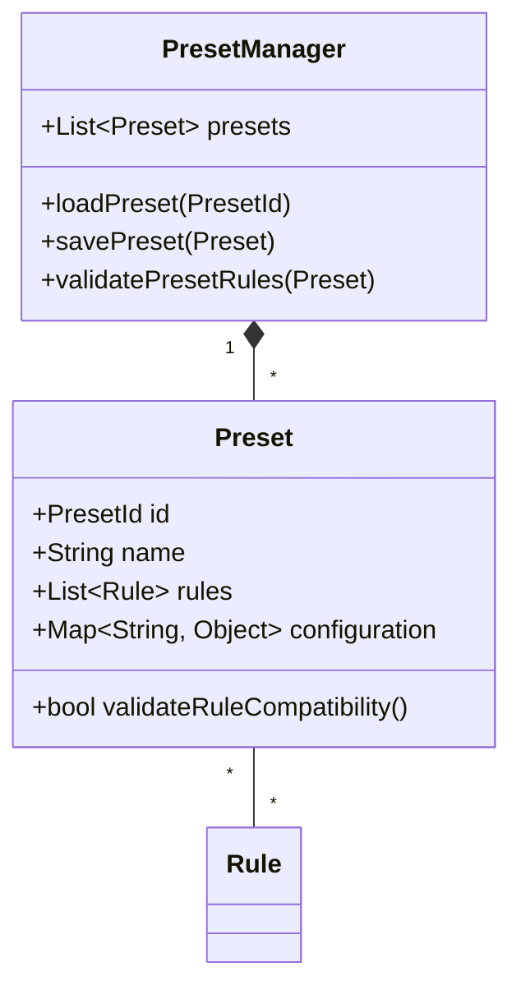
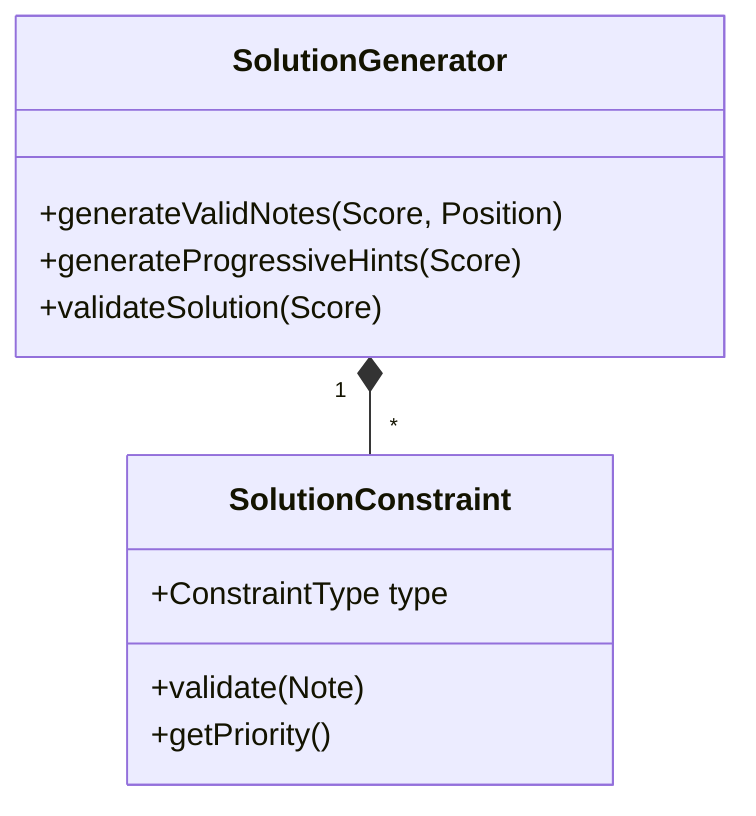
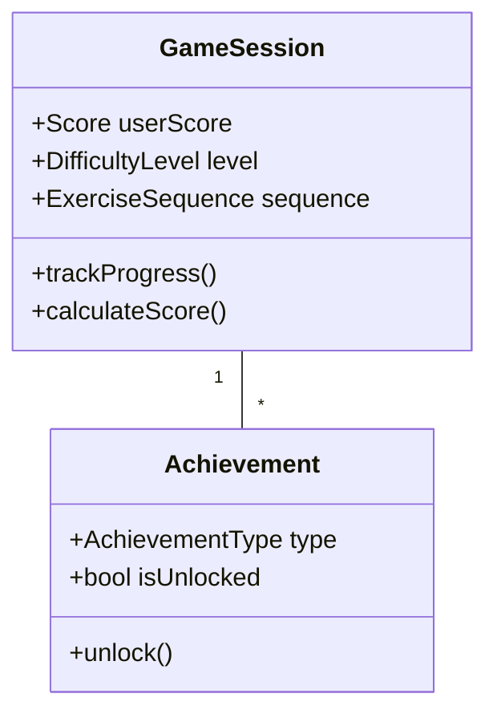
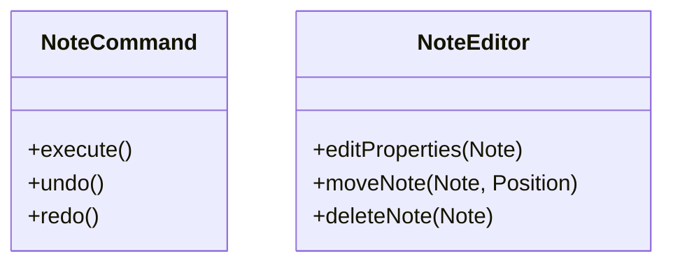
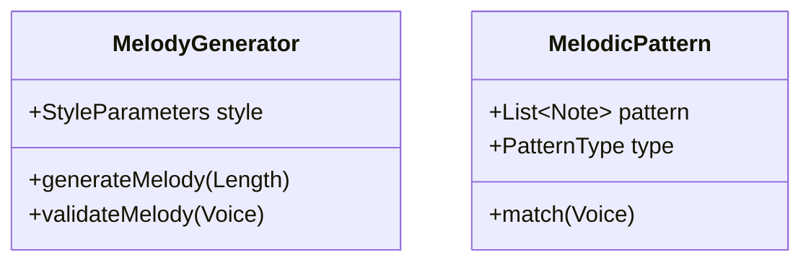
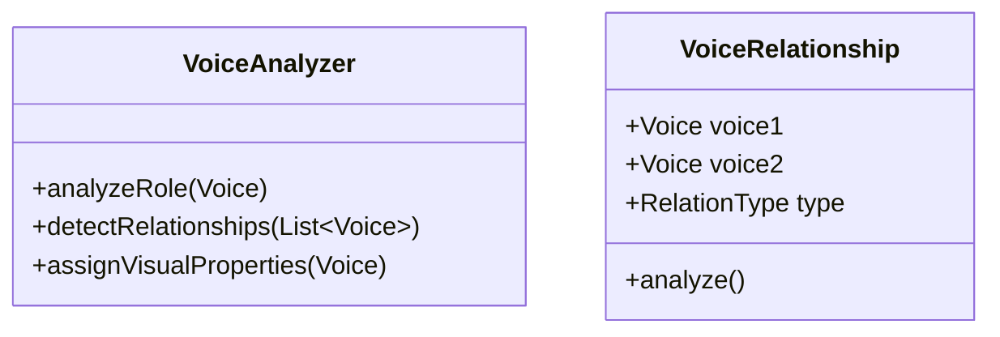

# Requirements Analysis

## 1. Modular Ruleset/Preset System

### Current Implementation
- Rule interface with validate() and getFeedback()
- RuleSet class managing multiple rules
- CounterpointRule implementation

### Gaps Identified
1. **Preset Management**
   - No explicit preset configuration system
   - Missing preset persistence
   - No mechanism for rule dependencies/conflicts

### Required Additions

## 2. Show Solutions Feature

### Current Implementation
- Exercise class with generateHint()
- No explicit solution generation system

### Gaps Identified
1. **Solution Generation**
   - Missing constraint solver for valid notes
   - No progressive hint system
   - Lack of performance optimization for real-time suggestions

### Required Additions

## 3. Testing Mode/Game

### Current Implementation
- Basic Exercise and ExerciseGenerator classes
- Missing game mechanics and scoring

### Gaps Identified
1. **Game Mechanics**
   - No scoring system
   - Missing difficulty progression
   - No achievement/progress tracking

### Required Additions

## 4. GUI Note Manipulations

### Current Implementation
- Basic Note class with properties
- No explicit GUI interaction model

### Gaps Identified
1. **Note Manipulation**
   - Missing drag-and-drop operations
   - No undo/redo system
   - Lack of note property editors

### Required Additions

## 5. Automatic Melody Generation

### Current Implementation
- ExerciseGenerator class
- Missing specific melody generation logic

### Gaps Identified
1. **Melody Generation**
   - No musical style parameters
   - Missing melodic pattern recognition
   - Lack of progression rules

### Required Additions

## 6. Voice Recognition and Visualization

### Current Implementation
- Voice class with basic properties
- No automatic voice recognition

### Gaps Identified
1. **Voice Analysis**
   - Missing voice role detection
   - No voice relationship analysis
   - Lack of visual distinction system

### Required Additions

## Implementation Priorities

1. **High Priority**
   - Preset system implementation
   - Basic solution generation
   - Note manipulation commands

2. **Medium Priority**
   - Voice analysis system
   - Game mechanics
   - Melody generation

3. **Low Priority**
   - Achievement system
   - Advanced pattern recognition
   - Style-based generation

## Technical Considerations

1. **Performance**
   - Solution generation must be real-time
   - Voice analysis should be background task
   - Preset loading must be efficient

2. **Extensibility**
   - All generators should support plugins
   - Visual properties should be customizable
   - Rule system must be easily extended

3. **User Experience**
   - Immediate feedback for note manipulations
   - Clear visual distinction between voices
   - Intuitive preset management